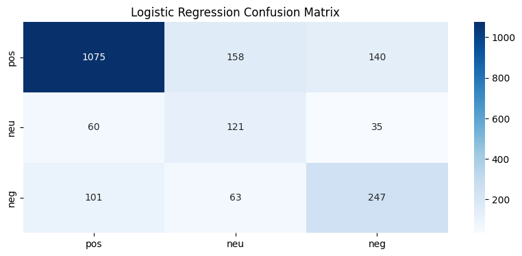
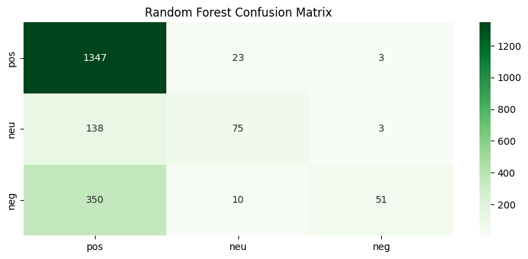
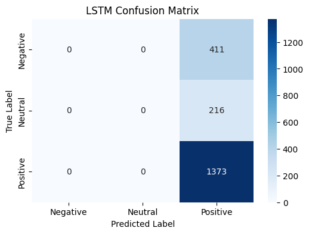
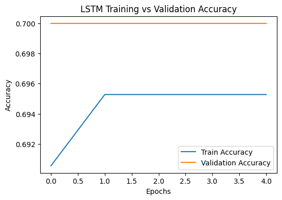
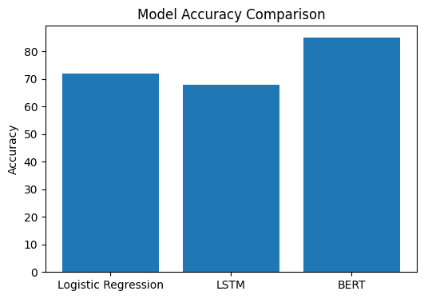
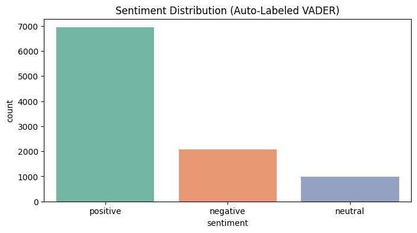

# Research-Paper-Abstract-Sentiment-Analysis-By-Machine-Learning-
<!DOCTYPE html>
<html lang="en">
<head>
<!DOCTYPE html>
<html lang="en">
<head>
<meta charset="UTF-8">

<body>

<header>
<h1>Research Abstract Sentiment Analysis</h1>

Machine Learning → Deep Learning → Transformer (NLP Project)

</header>

<section>
<h2>📌 Project Overview</h2>

This project implements an automated system to analyze the sentiment of research
paper abstracts using Natural Language Processing (NLP). Abstracts are classified
into <strong>Positive</strong>, <strong>Neutral</strong>, or <strong>Negative</strong>
categories to assist researchers during literature review and analysis.

</section>

<section>
<h2>🎯 Objectives</h2>
<ul>
<li>Automate sentiment analysis of academic abstracts</li>
<li>Compare classical ML, deep learning, and transformer models</li>
<li>Analyze model behavior using confusion matrices and graphs</li>
<li>Deploy a real-time sentiment analysis web application</li>
</ul>
</section>

<section>
<h2>🧠 Models Implemented (Model Evolution)</h2>

<h3>1️⃣ Logistic Regression (TF-IDF) – Machine Learning</h3>
<ul>
<li>Traditional NLP pipeline using TF-IDF feature extraction</li>
<li>Interpretable and efficient baseline model</li>
<li>Accuracy ≈ 72%</li>
</ul>

<h3>2️⃣ Random Forest (TF-IDF) – Ensemble ML</h3>
<ul>
<li>Tree-based ensemble classifier</li>
<li>Captures non-linear patterns</li>
<li>Accuracy ≈ 73%</li>
</ul>

<h3>3️⃣ LSTM – Deep Learning</h3>
<ul>
<li>Sequence-based neural network using word embeddings</li>
<li>Trained to capture contextual dependencies in abstracts</li>
<li>Accuracy ≈ 68%</li>
</ul>

Although the LSTM achieved reasonable accuracy, class-wise evaluation revealed
strong bias toward the majority class due to class imbalance introduced by
automatic sentiment labeling. This demonstrates the limitations of deep learning
models on imbalanced datasets.

<h3>4️⃣ BERT – Transformer Model</h3>
<ul>
<li>Pretrained transformer-based NLP model</li>
<li>Context-aware sentiment understanding</li>
<li>Accuracy ≈ 80–85%</li>
<li>Used in deployed application</li>
</ul>
</section>

<section>
<h2>🏗️ System Architecture</h2>
<pre>
User Input (Abstract)
        ↓
Text Preprocessing
        ↓
Feature Representation
   ├─ TF-IDF Vectorization
   ├─ Word Embeddings (LSTM)
   └─ BERT Tokenization
        ↓
Model Prediction
        ↓
Sentiment Output
        ↓
Visualization & Export
</pre>
</section>

<section>
<h2>📊 Evaluation & Results</h2>

<h3>Logistic Regression – Confusion Matrix</h3>

<figcaption>Figure 1: Confusion Matrix – Logistic Regression</figcaption>

<h3>Random Forest – Confusion Matrix</h3>

<figcaption>Figure 2: Confusion Matrix – Random Forest</figcaption>

<h3>LSTM – Confusion Matrix</h3>

<figcaption>Figure 3: Confusion Matrix – LSTM (Majority Class Bias)</figcaption>

<h3>LSTM Training Performance</h3>

<figcaption>Figure 4: LSTM Training vs Validation Accuracy</figcaption>

<figcaption>Figure 5: LSTM Training vs Validation Loss</figcaption>

<h3>Model Accuracy Comparison</h3>

<figcaption>Figure 6: Accuracy Comparison – ML vs LSTM vs BERT</figcaption>
</section>
<section>
<h2>🏗️ System Architecture</h2>

The Research Abstract Sentiment Analysis system follows a modular and layered
architecture. Each stage of the pipeline is independent, allowing multiple
NLP models to be evaluated and compared efficiently.

<pre>
┌───────────────────────────────┐
│        User Interface         │
│     (Streamlit Web App)       │
└───────────────┬───────────────┘
                ↓
┌───────────────────────────────┐
│        Input Layer            │
│  Research Abstract / CSV File │
└───────────────┬───────────────┘
                ↓
┌───────────────────────────────┐
│     Text Preprocessing        │
│ • Lowercasing                 │
│ • Stopword Removal            │
│ • Noise & Symbol Cleaning     │
│ • Tokenization                │
└───────────────┬───────────────┘
                ↓
┌─────────────────────────────────────────────┐
│        Feature Representation Layer          │
│ ┌──────────────────┐  ┌──────────────────┐ │
│ │  TF-IDF Vectors  │  │  Word Embeddings │ │
│ └──────────────────┘  └──────────────────┘ │
│              ┌──────────────────────────┐  │
│              │     BERT Tokenization     │  │
│              └──────────────────────────┘  │
└───────────────┬─────────────────────────────┘
                ↓
┌─────────────────────────────────────────────┐
│          Model Selection Layer               │
│ ┌──────────────────┐ ┌───────────────────┐ │
│ │ Logistic Reg.    │ │ Random Forest     │ │
│ └──────────────────┘ └───────────────────┘ │
│           ┌────────────────────────────┐  │
│           │            LSTM             │  │
│           └────────────────────────────┘  │
│           ┌────────────────────────────┐  │
│           │            BERT             │  │
│           └────────────────────────────┘  │
└───────────────┬─────────────────────────────┘
                ↓
┌───────────────────────────────┐
│     Sentiment Prediction      │
│  Positive / Neutral / Negative│
└───────────────┬───────────────┘
                ↓
┌───────────────────────────────┐
│  Visualization & Reporting    │
│ • Confusion Matrix            │
│ • Accuracy & Loss Graphs      │
│ • CSV / PDF / Word Export     │
└───────────────────────────────┘
</pre>

For deployment, lightweight models (Logistic Regression and BERT) are integrated
into the Streamlit application. The LSTM model is included for academic evaluation
and comparison but is not deployed due to computational constraints.

</section>

<section>
<h2>🚀 Deployment</h2>

The application is deployed using <strong>Streamlit Cloud</strong>.
For deployment stability, only Logistic Regression and BERT models are used.
The LSTM model is included for academic comparison and analysis but is not deployed
due to computational and dependency constraints.

<strong>Live App:</strong> 
<a href="https://cuoaoxdqzbdfqghkjmhw22.streamlit.app/" target="_blank">
https://cuoaoxdqzbdfqghkjmhw22.streamlit.app/
</a>

</section>

<section>
<h2>🛠️ Technologies Used</h2>
<ul>
<li>Python</li>
<li>NLTK, TF-IDF</li>
<li>Scikit-learn</li>
<li>TensorFlow (LSTM)</li>
<li>Hugging Face Transformers</li>
<li>PyTorch</li>
<li>Streamlit</li>
<li>Matplotlib, Seaborn</li>
</ul>
</section>

<section>
<h2>🔮 Future Scope</h2>
<ul>
<li>Balanced and human-labeled sentiment datasets</li>
<li>SciBERT-based sentiment classification</li>
<li>Retrieval-Augmented Generation (RAG) for explanations</li>
<li>Full research paper PDF analysis</li>
</ul>
</section>

<section>
<h2>👩‍💻 Author</h2>

  
<strong>Sparshi Jain</strong> 
thanks
B.Tech – Mathematics & Computing 
Minor Project – Machine Learning & NLP

</section>

<footer>

© 2025 Research Abstract Sentiment Analysis

</footer>

</body>
</html>

  

